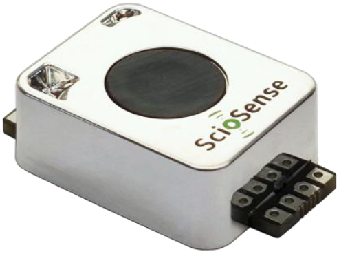
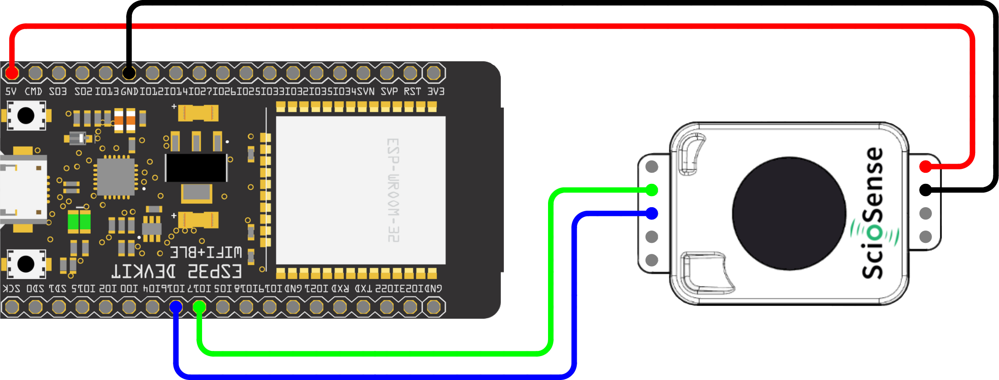

# ScioSense ENS190 Arduino Library
Arduino library for the ENS190 CO2 sensor.

The ENS190 is a high-performance, non-dispersive infrared (NDIR) CO₂ sensor designed
for precise and reliable carbon dioxide measurement. It complies with key regulatory
standards such as California Title 24, RESET, WELL, and ASHRAE. It is an ideal solution
for air quality monitoring in smart buildings, HVAC systems, and other indoor
environments.

## Links
* [ENS190 Datasheet](https://www.sciosense.com/wp-content/uploads/2025/04/ENS190-Datasheet.pdf)
* [Further information about the ENS190](https://www.sciosense.com/ens190/)

## Prerequisites
It is assumed that
 - The Arduino IDE has been installed.
   If not, refer to "Install the Arduino Desktop IDE" on the
   [Arduino site](https://www.arduino.cc/en/Guide/HomePage).
- The library directory is at its default location. Normally this is `C:\Users\[your_username]\Documents\Arduino\libraries`.

You might need to add your board to the Arduino IDE. This library was tested with the [Espressif ESP32](https://www.espressif.com/en/products/socs/esp32). 
For the installation of the ESP32 in the Arduino IDE, see [Arduino ESP32 Installation](https://docs.espressif.com/projects/arduino-esp32/en/latest/installing.html)

## Installation

### Installation via Arduino Library Manager
- In the Arduino IDE, navigate to the Arduino Library Manager on the left side (or, alternatively, select Sketch > Include Library > Manage Libraries...)
- Search for `ScioSense_ENS190`
- Select the library from the search results and press `Install`

### Manual installation
- Download the code from this repository via "Download ZIP".
- In Arduino IDE, select Sketch > Include Library > Add .ZIP library... and browse to the just downloaded ZIP file.
- When the IDE is ready this README.md should be located at `C:\Users\[your_username]\Documents\Arduino\libraries\ScioSense_ENS190\README.md`.

## Wiring

### General
Please make sure that you use the correct supply voltage:
- The ENS190 runs at VDD = 5V.
- The serial communication runs at 5V, and supports UART, RS485, and Modbus.

### Example UART with ESP32
This example shows how to wire a [ESP32DevKitC](https://docs.espressif.com/projects/esp-idf/en/latest/esp32/hw-reference/esp32/get-started-devkitc.html#get-started-esp32-devkitc-board-front) 
with the ENS190 breakout board for UART communication.

| ENS190 |   ESP32   |
|:------:|:---------:|
|  VDD   |    5V     |
|  GND   |    GND    |
|  RXD   |  TX2(17)  |
|  TXD   |  RX2(16)  |

